# Impetus Aquae Fontis — Architecture Plan

## 1. Overview

Impetus Aquae Fontis is a field-level water management platform that combines water storage infrastructure of any scale, sensor networks, satellite imagery, and predictive AI to support flood mitigation and drought resilience.

The system monitors agricultural fields through distributed water-measurement sensors and satellite-derived indicators. Sensor nodes communicate locally and relay field conditions to a gateway. The gateway forwards the data to the server, where the platform combines sensor history, short-term measurements, long-term trends, meteorological data, and satellite imagery to generate predictions and recommendations for landowners.

The main output of the system is a decision recommendation:

- Store excess water
- Hold current state
- Release stored water for irrigation
- Alert landowners of flood or drought risk

---

## 2. High-Level System Architecture

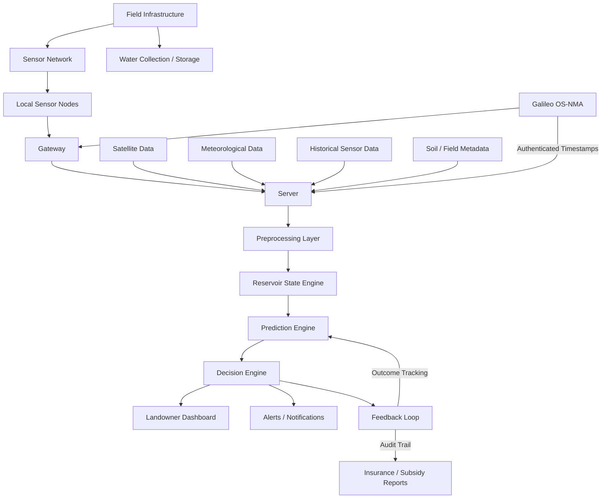

---

## 3. Field-Level Infrastructure

Each agricultural field contains a physical water-management layer and a sensing layer.

### 3.1 Water Infrastructure

The water storage and delivery infrastructure scales to the landowner's situation. This can range from simple rain barrels and collection tanks for smallholders to subsurface pipe networks for large-scale operations.

**Small-scale (smallholder / garden):**

- Rain barrels or water tanks collecting roof or field runoff
- Simple rain gutters or channels directing runoff to collection points

**Medium-scale (small farm):**

- Above-ground water tanks or cisterns (1–50 m³)
- Field drainage channels directing runoff to a collection pond or tank

**Large-scale (commercial farm):**

- Subsurface pipes for extracting excess surface water
- Underground storage reservoirs or aquifer recharge zones

The system focuses on **collecting and storing runoff water** and **advising when to use it**. How the landowner applies the stored water to crops (manual watering, hose, drip, sprinkler, etc.) is outside the scope of the platform.

### 3.2 Sensor Infrastructure

Sensors are installed across the field to measure local water and soil conditions.

Possible sensor measurements include:

- Soil moisture at different depths
- Groundwater level
- Pipe flow rate
- Water pressure
- Local temperature
- Pump or valve status
- Battery level and device health

---

## 4. Local Sensor Network

Sensor nodes communicate with each other and relay data toward a gateway.

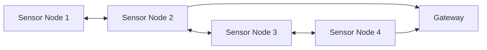

The local network should be designed to work even when individual sensors have weak connectivity. A mesh-like communication pattern can allow nearby sensors to pass messages between each other until the data reaches the gateway.

One possible communication technology is LoRa. LoRa is well suited for this use case because it consumes very little power, allowing battery-powered sensor nodes to operate for months or years without replacement. It also provides a long effective range — typically several kilometres in rural open-field environments — which means fewer gateways are needed to cover large agricultural areas. LoRa signals can also penetrate soil to some extent, which is important since the sensors in this system are buried underground to measure soil moisture at depth. Additionally, LoRa operates in unlicensed frequency bands and is designed for transmitting small sensor payloads at low data rates, which matches the intermittent soil moisture and water level readings this system produces.

For the hackathon prototype, the sensor network can be simulated with generated or historical sensor data.

---

## 5. Gateway

The gateway is responsible for collecting sensor readings from the field and forwarding them to the server.

### Gateway responsibilities

- Receive sensor measurements
- Validate sensor messages
- Add timestamps and field identifiers
- Temporarily cache data if internet connectivity is unavailable
- Forward data to the server
- Optionally receive recommendations to display to the landowner

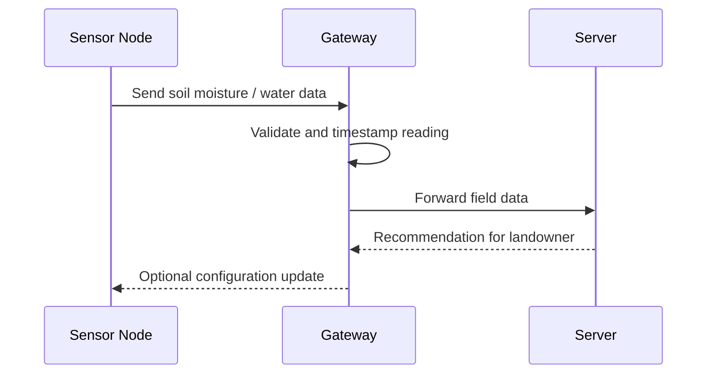

---

## 6. Server

The server is the core computation and coordination layer of the platform.

It receives data from:

- Local field sensors
- Satellite imagery sources
- Meteorological APIs
- Soil and field metadata databases
- Historical measurements

The server is responsible for storing, preprocessing, analyzing, and turning this data into predictions and recommendations.

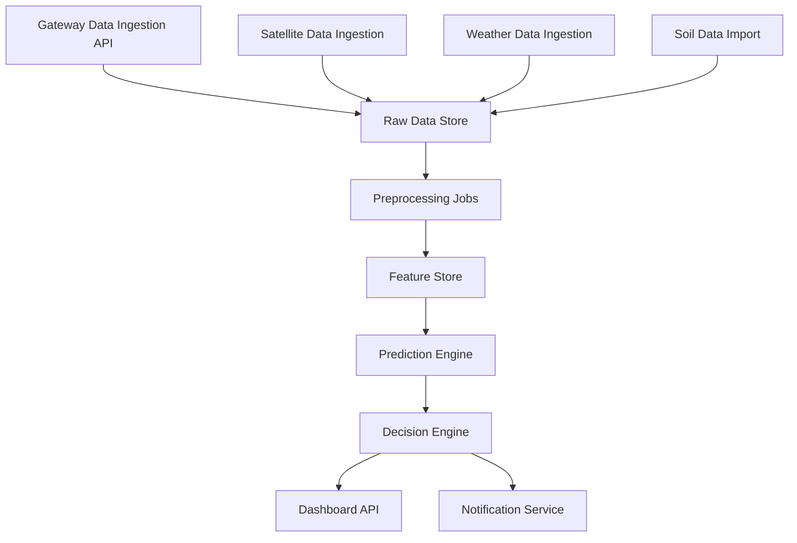

---

## 7. Data Sources

## 7.1 Local Sensor Data

Local sensor data provides ground-truth information about the field.

It can be divided into:

### Short-term data

Used for immediate decisions.

Examples:

- Current soil moisture
- Soil moisture trend over the last 24 hours
- Current groundwater level
- Pipe pressure
- Pump status

### Long-term historical data

Used for prediction and trend analysis.

Examples:

- Seasonal soil moisture patterns
- Historical drought periods
- Historical flooding events
- Water usage trends
- Field-specific response to rainfall

---

## 7.2 Satellite Data

Satellite imagery is used to monitor field conditions beyond the local sensors.

Important satellite-derived indicators:

- NDVI for vegetation health
- NDWI for crop or soil water stress
- Surface water detection for flooding or ponding
- Soil moisture proxies from radar data

Sources integrated in the prototype:

- **Copernicus ERA5** — Reanalysis weather data (precipitation, temperature, evapotranspiration, humidity) via Open-Meteo gateway
- **Copernicus ERA5-Land** — Multi-depth soil moisture (0–7 cm, 7–28 cm, 28–100 cm) at ~9 km resolution
- **Copernicus GloFAS** — Global Flood Awareness System river discharge data via Open-Meteo Flood API, used for the Tisza lateral seepage model
- **Sentinel-2 proxy** — NDVI and NDWI derived from crop phenology model (production system would use real S2 L2A Band 4/8/11 data from 2015+)
- **Sentinel-1 proxy** — SAR VV backscatter derived from ERA5-Land surface moisture using the inverse Dubois model (production system would use real S1 GRD data from 2014+)
- **ISRIC WoSIS** — World Soil Information Service bulk density data for spatially-varying soil characterization (3 soil zones: clay, transition, sandy)
- **Eurostat** — apro_cpsh1 crop yield statistics (26 years, 2000–2025) for ML model training

---

## 7.3 Meteorological Data

Meteorological data provides the external weather context needed for predictions.

Useful variables:

- Rainfall in the last 24 hours
- Rainfall in the last 7 days
- Forecast rainfall for the next 3 to 7 days
- Temperature
- Wind speed
- Relative humidity
- Evapotranspiration estimate
- Drought indicators

---

## 7.4 Soil and Field Metadata

Soil and field metadata helps the system understand how water behaves in each field.

Useful field attributes:

- Field boundary polygon
- Soil type
- Sand / silt / clay ratio
- Infiltration rate
- Water-holding capacity
- Slope and elevation
- Crop type
- Root depth
- Drainage characteristics

---

## 8. Preprocessing Layer

The preprocessing layer converts raw data into features that the prediction engine can use.

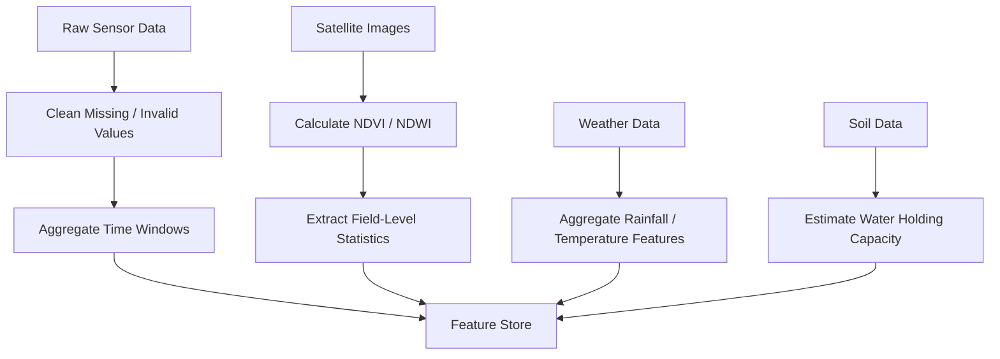

Example features:

- `soil_moisture_current`
- `soil_moisture_24h_change`
- `soil_moisture_7d_average`
- `rainfall_last_24h`
- `rainfall_forecast_72h`
- `ndvi_mean`
- `ndwi_mean`
- `surface_water_ratio`
- `estimated_infiltration_rate`
- `field_water_holding_capacity`

---

## 9. Reservoir State Engine

The Reservoir State Engine is a core component that models the landowner's water storage system — whether that is a single rain barrel or a large underground reservoir. It tracks, forecasts, and optimizes the stored water supply.

### 9.1 Reservoir State Model

The engine maintains a real-time state for each landowner's storage:

- `reservoir_level_m3` — current stored water volume
- `reservoir_capacity_m3` — maximum storage capacity
- `fill_rate_m3_per_day` — current inflow from runoff capture
- `depletion_rate_m3_per_day` — current outflow from irrigation or leakage
- `days_until_full` — projected days to reach capacity at current fill rate
- `days_until_empty` — projected days to depletion at current usage rate

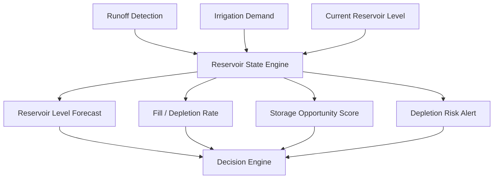

### 9.2 Water Balance Equation

The engine uses a daily soil water balance to track moisture and runoff:

```text
soil_moisture[t+1] = soil_moisture[t] + precipitation - crop_evapotranspiration - deep_percolation

IF soil_moisture > field_capacity THEN
    runoff = soil_moisture - field_capacity
    collectible_runoff = runoff × capture_efficiency
    reservoir_level += collectible_runoff × field_area

IF irrigation_applied THEN
    water_used = amount_released_by_landowner
    reservoir_level -= water_used
```

### 9.3 Key Parameters

Each field-storage pair is configured with physical parameters that match the landowner's setup:

| Parameter | Description | Small-scale example | Large-scale example |
|-----------|-------------|---------------------|---------------------|
| `field_area_ha` | Field size | 0.5 ha (garden) | 50 ha |
| `reservoir_capacity_m3` | Maximum storage | 0.2 m³ (rain barrel) | 15,000 m³ |
| `runoff_capture_efficiency` | Fraction of runoff collected | 0.10 (10%) | 0.25 (25%) |
| `soil_field_capacity_mm` | Maximum water the root zone can hold | 300 mm | 300 mm |
| `soil_wilting_point_mm` | Minimum water before permanent crop damage | 100 mm | 100 mm |

### 9.4 Reservoir Forecast Output

The engine produces a rolling forecast that feeds into both the Prediction Engine and the Decision Engine:

- **7-day reservoir level projection** — will we run out? Will we overflow?
- **Seasonal depletion curve** — how long will stored water last under current demand?
- **Optimal fill/release schedule** — when to collect vs when to irrigate
- **Conversion: mm ↔ m³** — all recommendations are expressed in both agronomic units (mm) and physical volumes (m³) for farmer clarity

---

## 10. Prediction Engine

The prediction engine estimates future water-related risks and field conditions using a multi-model approach.

Main prediction tasks:

- Flood risk prediction
- Drought risk prediction
- Soil moisture forecasting
- Water storage opportunity detection
- Irrigation need prediction
- **Crop yield prediction** (with and without irrigation)
- **Lateral seepage estimation** from nearby rivers

### 10.1 Detrended Anomaly Yield Model

The prototype's ML yield prediction uses a novel two-stage approach designed for small datasets (26 years of Eurostat data):

**Stage 1 — Detrending:** A linear trend is fitted to historical yields to remove the long-term technology/management improvement signal (~+0.085 t/ha/year for Hungarian maize). The model then predicts only the weather-driven **yield anomaly** — the deviation from expected trend yield.

**Stage 2 — Ridge + GBM Ensemble:**
- **Ridge regression** (α=1.0) provides a stable baseline prediction of the anomaly using 12 Copernicus-derived features
- **Gradient Boosting** captures residual nonlinearities (drought collapse thresholds, heat×deficit interactions)
- Final prediction = trend(year) + Ridge(anomaly) + GBM(residual)

**Key features (12 total, engineered for drought detection):**

| Feature | Source | Purpose |
|---------|--------|---------|
| `water_deficit_mm` | ERA5 | Season-level water stress |
| `heat_stress_days` | ERA5 | Days with T_max > 35°C |
| `dry_spells_max` | ERA5 | Longest consecutive dry period |
| `jul_deficit_mm` | ERA5 | July deficit (critical for maize pollination) |
| `jun_jul_deficit` | ERA5 | Combined Jun+Jul deficit |
| `heat_x_deficit` | Interaction | Heat × deficit interaction — captures nonlinear crop collapse |
| `precip_et0_ratio` | ERA5 | Precipitation efficiency (P/ET₀) |
| `sm_surface_mean` | ERA5-Land | Mean surface soil moisture |
| `sm_surface_min` | ERA5-Land | Minimum surface moisture (worst-case stress) |
| `sm_dry_days` | ERA5-Land | Days with soil moisture < 0.15 m³/m³ |
| `s2_ndvi_peak` | Sentinel-2 | Peak vegetation health |
| `s2_ndvi_decline_rate` | Sentinel-2 | Rate of vegetation senescence (late-season stress marker) |

**Validation (Leave-One-Out Cross-Validation, 26 years):**
- MAE: 0.47 t/ha (10.2%)
- Correctly ranks drought years (2003: predicted 2.64 vs actual 2.63) and good years (2015: 5.07 vs 5.18)

### 10.2 Analog Year Matching

For in-season prediction (before harvest), the system uses **analog year matching** to project incomplete season data:

1. Fetch real ERA5 weather data from April 1 to the current date
2. Compute standardized Euclidean distance to all historical years on key features
3. Select the 5 most similar years as analogs
4. Blend real observations (weighted by season fraction) with analog projections for remaining months
5. Feed blended full-season features to the Ridge + GBM ensemble

### 10.3 Lateral Seepage Model (Dupuit-Forchheimer)

The prototype includes a steady-state unconfined aquifer model estimating groundwater lateral seepage from the Tisza river into adjacent agricultural land:

- **Input:** GloFAS river discharge (Copernicus) → rating curve → river water level
- **Model:** Dupuit-Forchheimer equation with spatially-varying hydraulic conductivity from WoSIS soil data
- **Soil zones:** 3 zones derived from ISRIC WoSIS bulk density measurements (clay near river K=1.5–3.0 m/day, transition K=8–15 m/day, sandy outer plains K=25 m/day)
- **Output:** Water table profile at 5 transect bands (0–20 km from river), capillary rise contribution to root-zone moisture

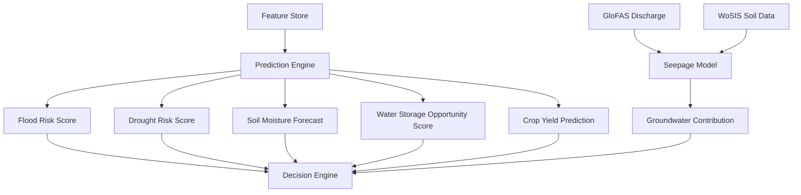

---

## 11. Decision Engine

The decision engine converts predictions into actionable **recommendations for the landowner**. The system is advisory — all physical actions (activating pumps, opening valves) remain under the landowner's control.

Possible recommendations:

- Store water
- Release water
- Hold current state
- Send warning
- Request manual inspection
- Generate insurance or subsidy report

> **Note:** The server never directly controls field infrastructure. All physical actions are performed by the landowner based on the system's recommendations.

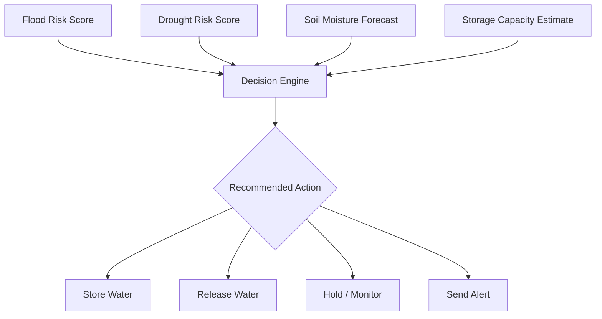

Example decision logic:

```text
IF flood_risk is high
AND storage_capacity is available
THEN recommend storing water

IF drought_risk is high
AND soil_moisture_forecast is low
AND stored_water_available is true
THEN recommend releasing water

IF both flood_risk and drought_risk are low
THEN monitor
```

---

## 12. Feedback Loop and Outcome Tracking

The system includes a closed feedback loop that tracks the outcomes of its recommendations. This is critical for continuous model improvement, building trust with landowners, and providing auditable evidence of system performance.

### 12.1 Feedback Architecture

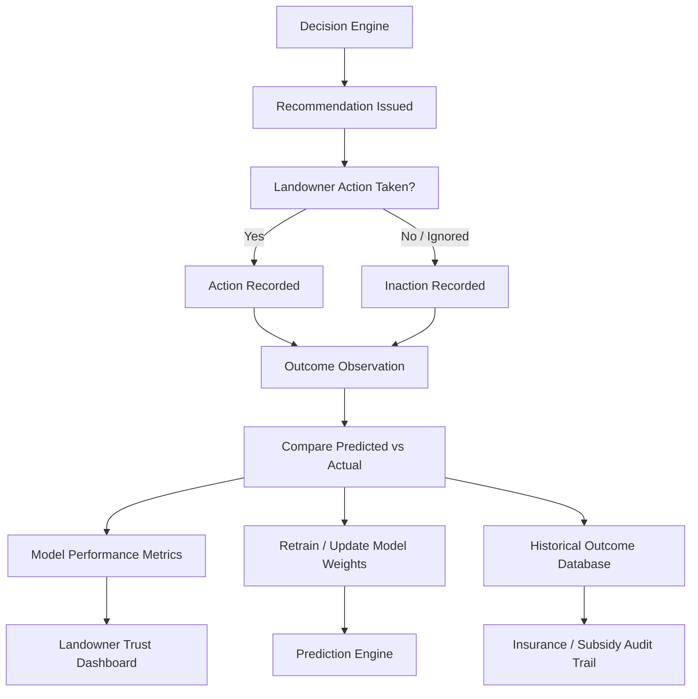

### 12.2 What Gets Tracked

For every recommendation the system issues, the following is recorded:

| Event | Data Captured |
|-------|---------------|
| **Recommendation issued** | Timestamp, field ID, action type (store / release / hold), predicted risk scores, confidence level |
| **Action taken** | Whether the landowner followed the recommendation, when, and what they did |
| **Outcome observed** | Soil moisture change over following days, actual rainfall vs forecast, crop stress indicators (NDVI change), actual yield at harvest |
| **Model accuracy** | Predicted soil moisture vs actual sensor reading, predicted yield vs actual yield |

### 12.3 Outcome Metrics

The system computes and displays:

- **Recommendation accuracy** — what percentage of store/release/hold recommendations were correct in hindsight?
- **Yield impact** — fields that followed irrigation recommendations vs those that did not
- **Reservoir efficiency** — how much stored water was actually used productively?
- **False alarm rate** — how often did the system trigger drought or flood alerts that did not materialize?

### 12.4 Model Improvement Cycle

At the end of each growing season:

1. Actual crop yields are collected (from landowner input or Eurostat regional data)
2. Actual weather is compared against forecasts used at decision time
3. Prediction errors are computed per field
4. The ML model is retrained with the new season's data appended to the training set
5. Feature importance is re-evaluated — did the model learn from its mistakes?

This creates a system that gets smarter with each season of operation.

---

## 13. Landowner Interface

The prototype implements an MSN Weather-inspired dark-theme web dashboard with two main tabs.

### Tab 1: Field Monitor

Real-time field monitoring and yield prediction for a specific location (Szeged, Hungary).

- **7-day soil moisture forecast** — daily projected moisture, ET₀, precipitation, runoff opportunity
- **ML yield prediction** — detrended Ridge+GBM ensemble shows expected yield ± trend
- **Irrigation impact analysis** — compares yield with vs without stored-water irrigation
- **Analog year matching** — shows 5 most similar historical years with yield outcomes
- **Alert system** — drought alerts, irrigation schedules, runoff collection opportunities
- **Water balance breakdown** — precipitation, ET₀, deep percolation, deficit analysis
- **Date picker** — explore any historical date to compare past conditions and model accuracy

### Tab 2: Tisza River Monitor

Interactive map showing lateral water dynamics from the Tisza river into agricultural land.

- **Leaflet.js interactive map** with 5 parallel transect bands (0–4 km, 4–8 km, ..., 16–20 km from river bank)
- **River course** from GPX waypoints overlaid on the map
- **Dual overlay system** (toggled by button):
  - **Soil moisture overlay** — ERA5-Land volumetric moisture + Dupuit-Forchheimer seepage contribution
  - **Crop yield overlay** — climate-based yield estimates using growing-season precipitation rate and heat stress
- **Seepage profile** — sidebar cards showing water table depth, capillary rise, and effective root-zone moisture per band
- **River discharge** — real-time GloFAS data with rating-curve-derived water level

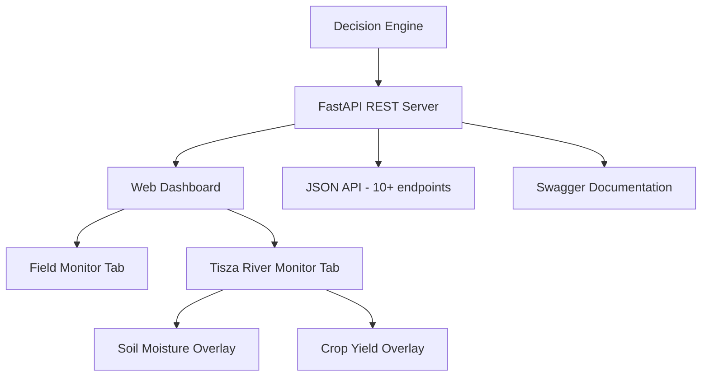

---

## 14. Prototype Scope

The hackathon prototype demonstrates the full intelligence and decision-making flow using real Copernicus satellite data, without requiring deployed hardware.

### Implemented (working prototype)

- **Real Copernicus data integration** — ERA5 weather, ERA5-Land soil moisture, GloFAS river discharge, Sentinel-1/2 proxies
- **ISRIC WoSIS soil characterization** — 3 soil zones with measured bulk density, derived porosity and hydraulic conductivity
- **Detrended Ridge + GBM yield model** — 26 years of Eurostat data, 12 engineered features, LOO-CV MAE 0.47 t/ha
- **Dupuit-Forchheimer lateral seepage model** — groundwater contribution from Tisza river with spatially-varying soil properties
- **7-day water balance forecast** — daily soil moisture, ET₀, runoff collection, reservoir management
- **Crop yield prediction with irrigation impact** — shows yield improvement from stored-water irrigation
- **Dual-overlay Tisza River Monitor** — interactive map with 5 transect bands showing soil moisture or crop yield
- **MSN Weather-style web dashboard** — two tabs (Field Monitor + Tisza River Monitor), auto-refresh, date picker for historical analysis
- **REST API with 10+ endpoints** — FastAPI server with Swagger documentation
- **Alert system** — drought alerts, irrigation schedules, runoff opportunities, reservoir warnings

### Not yet implemented (future work)

- Real sensor hardware deployment
- Real Sentinel-1/2 image processing (currently using physics-based proxies)
- Automated pump/valve control (system is advisory — landowner operates)
- Multi-field / multi-region support
- Certified insurance/subsidy reporting
- Galileo OS-NMA authenticated timestamps (architecture designed, not yet integrated)
- Mobile-optimized interface

---

## 15. Prototype Data Flow

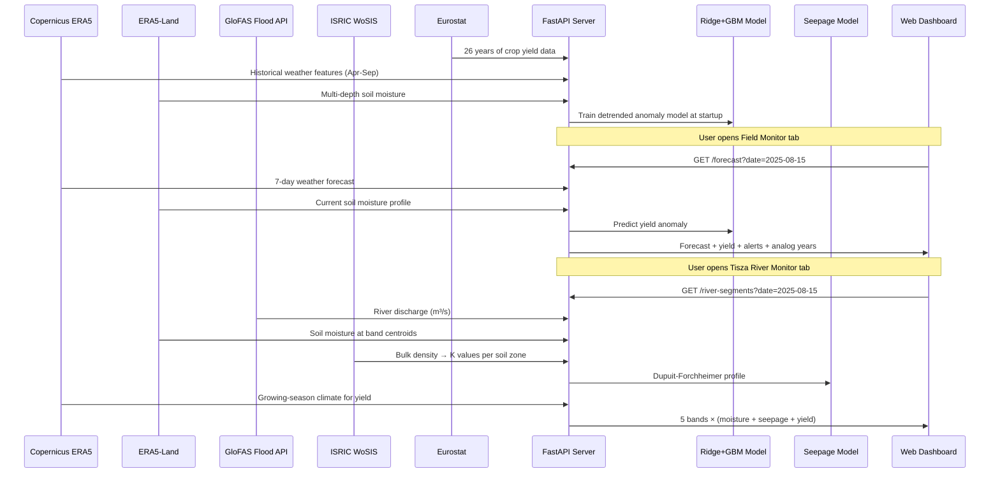

---

## 16. Galileo Integration Layer

Galileo, the EU's Global Navigation Satellite System (GNSS), provides a critical trust and precision layer to the platform. Its integration goes beyond simple positioning — it enables authenticated, tamper-proof data that is essential for insurance reporting, subsidy auditing, and precision infrastructure control.

### 16.1 Galileo Services Used

| Service | Purpose |
|---------|---------|
| **Galileo Open Service (OS)** | Centimetre-level positioning for sensor placement, field boundary mapping, and storage infrastructure geolocation |
| **OS-NMA (Navigation Message Authentication)** | Cryptographically authenticated GNSS timestamps and positions — proves that sensor data was recorded at a specific place and time, preventing spoofing or fraud |
| **High Accuracy Service (HAS)** | PPP corrections for precise field mapping and infrastructure positioning |

### 16.2 Integration Points

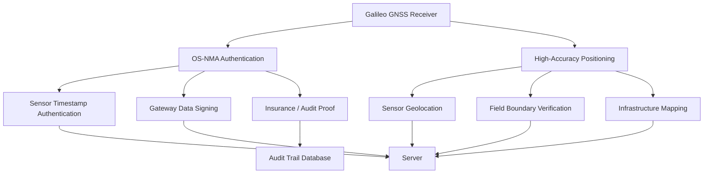

### 16.3 Authenticated Sensor Data

Every sensor reading transmitted through the gateway includes:

```text
{
  "sensor_id": "SM-0042",
  "field_id": "szeged-north-01",
  "timestamp": "2022-07-15T08:30:00Z",
  "galileo_authenticated": true,
  "gnss_fix": {
    "lat": 46.25312,
    "lon": 20.14821,
    "accuracy_cm": 4.2,
    "auth_method": "OS-NMA",
    "auth_status": "verified"
  },
  "measurements": {
    "soil_moisture_pct": 18.3,
    "groundwater_level_cm": -142
  }
}
```

This authenticated data chain means:
- **Insurers** can trust that drought/flood events actually occurred at the claimed location and time
- **Government subsidy programs** have auditable proof of sustainable water management practices
- **Landowners** have verifiable records that their fields are managed according to Green Deal requirements

### 16.4 Precision Infrastructure Mapping

For the physical water management layer (pipes, valves, pumps), Galileo HAS provides the centimetre-level accuracy needed to:

- Map and locate infrastructure components (tanks, pipes, collection points)
- Verify that infrastructure positions match the planned installation layout
- Provide precise field boundary data for accurate per-field calculations
- Help landowners locate specific valves and pipe segments when performing manual operations

---

## 17. Production Architecture Considerations

For a real deployment, the system should include:

- Secure device authentication
- Encrypted sensor communication
- Fault-tolerant gateway storage
- Cloud database with time-series support
- Scalable geospatial processing
- Model monitoring
- Human override for infrastructure control
- Audit logs for insurance and subsidy reporting
- Galileo/GNSS-based authenticated location and timing where available

---

## 18. Suggested Technology Stack

### Field / IoT layer

- LoRaWAN or Zigbee sensor nodes
- Gateway using Raspberry Pi or industrial gateway hardware
- MQTT for device messaging

### Backend

- Python / FastAPI
- PostgreSQL with PostGIS
- TimescaleDB for time-series sensor data
- Object storage for satellite imagery
- Redis or message queue for background jobs

### Data processing

- Python 3
- Pandas, NumPy for feature engineering and data wrangling
- Requests for API calls (Open-Meteo, Eurostat SDMX)
- CSV parsing for WoSIS soil data
- GPX parsing for river waypoint coordinates

### AI / prediction

- **Ridge regression + Gradient Boosting ensemble** — detrended anomaly model for yield prediction
- **Analog year matching** — for in-season forecasting with incomplete data
- **Dupuit-Forchheimer groundwater model** — lateral seepage from river to farmland
- **WoSIS pedotransfer functions** — bulk density → porosity → hydraulic conductivity
- Scikit-learn (Ridge, GradientBoostingRegressor, StandardScaler, cross-validation)
- NumPy, Pandas for feature engineering

### Frontend

- Vanilla JavaScript dashboard (no framework dependency)
- Leaflet.js for interactive map visualization with polygon overlays
- Dual-overlay system (soil moisture / crop yield) on Tisza transect bands
- MSN Weather-inspired dark theme with auto-refresh

---

## 19. Key System Assumptions

- Each field has a known boundary polygon.
- Sensor readings are timestamped and linked to a field.
- The gateway has periodic internet connectivity.
- Satellite data is available often enough for field-level monitoring.
- Weather forecasts are available from an external API.
- The prototype can use simulated sensor data where real sensors are unavailable.
- Automated physical control is not required for the MVP; recommendations can be shown to landowners first.

---

## 20. Summary

The proposed architecture uses a layered system:

1. Field pipes and sensors measure local water conditions.
2. Sensor nodes communicate through a local network.
3. A gateway forwards measurements to the server.
4. The server combines sensor data with Copernicus satellite data (ERA5, ERA5-Land, GloFAS, Sentinel-1/2), ISRIC WoSIS soil data, Eurostat yield statistics, and weather forecasts.
5. A reservoir state engine tracks and forecasts water storage levels at any scale (from rain barrels to underground reservoirs), converting between agronomic (mm) and physical (m³/litres) units.
6. A **detrended Ridge + GBM ensemble** predicts crop yield anomalies using 12 engineered features including drought interaction terms (heat×deficit, precip/ET₀ ratio), achieving LOO-CV MAE of 0.47 t/ha (10.2%) over 26 years.
7. A **Dupuit-Forchheimer lateral seepage model** estimates groundwater contribution from the Tisza river using GloFAS discharge data and WoSIS-derived spatially-varying soil properties.
8. A decision engine recommends whether to store, hold, or release water, incorporating yield impact analysis.
9. A feedback loop tracks outcomes of every recommendation, compares predicted vs actual results, and retrains the model each season.
10. Galileo OS-NMA provides authenticated timestamps and positions for fraud-proof sensor data, enabling trusted insurance and subsidy reporting.
11. Landowners receive predictions and recommended actions through an **interactive web dashboard** with dual-overlay maps (soil moisture and crop yield across river transect bands) and ML-driven yield forecasts showing irrigation impact.

The hackathon prototype demonstrates the full intelligence pipeline using real Copernicus data, real Eurostat yields, and real WoSIS soil measurements — proving the concept works with actual satellite observations rather than simulated data.

---

## 21. Gateway and Field Sensor Mesh Diagram

This diagram represents the local field-level communication layout. Multiple sensor nodes are distributed across the field. They communicate with nearby nodes and relay measurements toward the gateway at the field boundary.

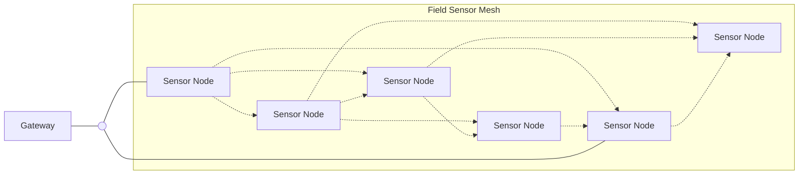

### Diagram meaning

- The **gateway** sits at the edge of the field.
- The **circle** represents the gateway connection point into the field network.
- The rectangular nodes represent **soil moisture / water measurement sensors**.
- The dotted connections represent local wireless communication between nearby sensors.
- Sensor data can travel through multiple nodes before reaching the gateway.
- The gateway forwards the collected data to the server for preprocessing, prediction, and landowner-facing recommendations.

---

## 22. Multi-Region System Layout

The following diagram shows the full concept at a higher level. Multiple agricultural regions contain several monitored fields. Each field has a local measurement point or sensor cluster. These field-level nodes communicate with the server, where the AI model processes local field data together with external public and satellite data.

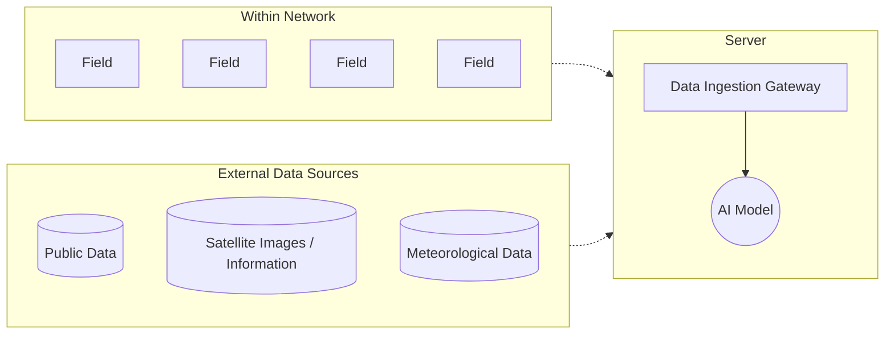

### Diagram meaning

- Each **Region** represents a monitored agricultural area.
- Each **Field** contains pipes, water-measurement sensors, and field-level monitoring equipment.
- The small circular nodes represent local sensor or gateway connection points attached to each field.
- Dotted lines represent data transmission from the fields to the server.
- The **Server** receives all regional field data through a data ingestion gateway.
- The **AI Model** combines field data with public datasets, satellite images, and meteorological information.
- The result of the AI computation is used to generate predictions and recommendations for landowners.

